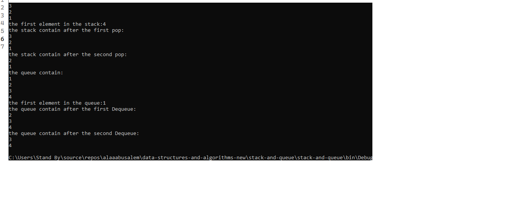
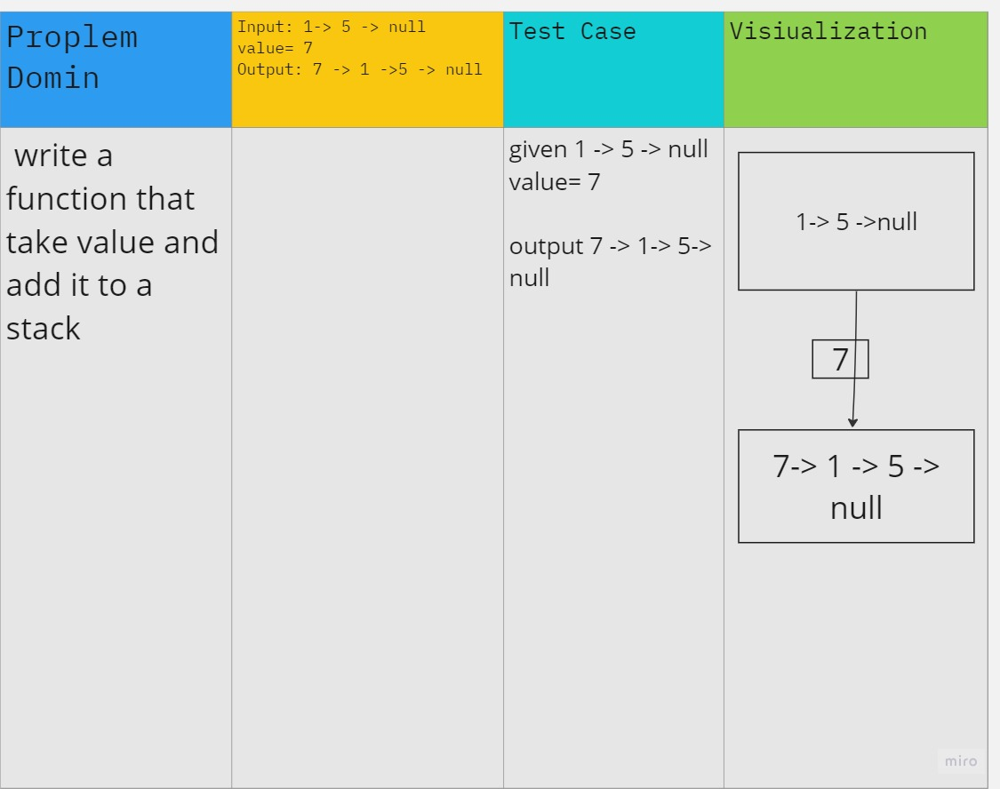
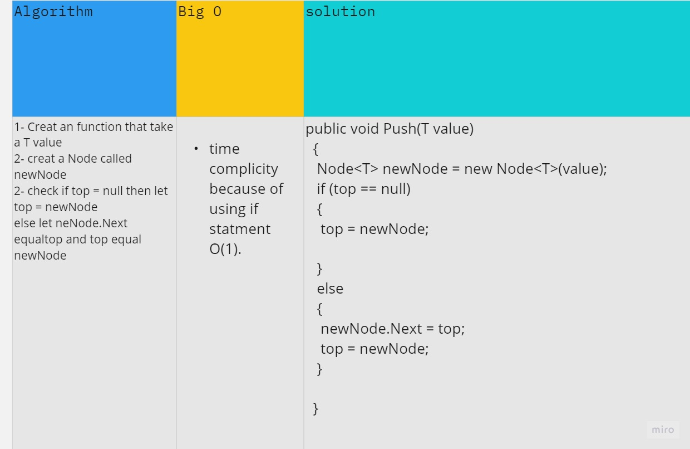
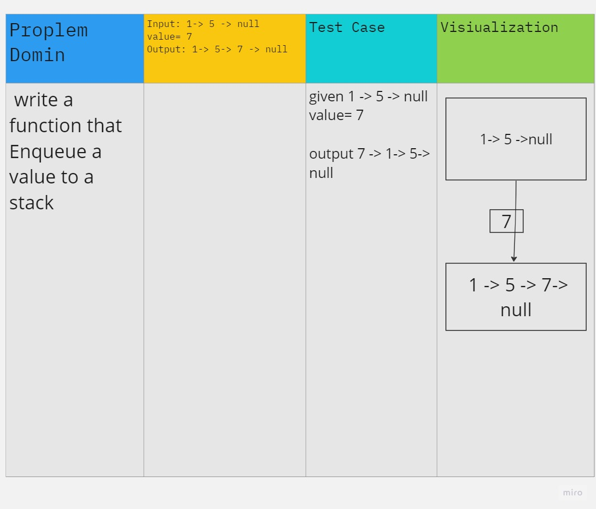
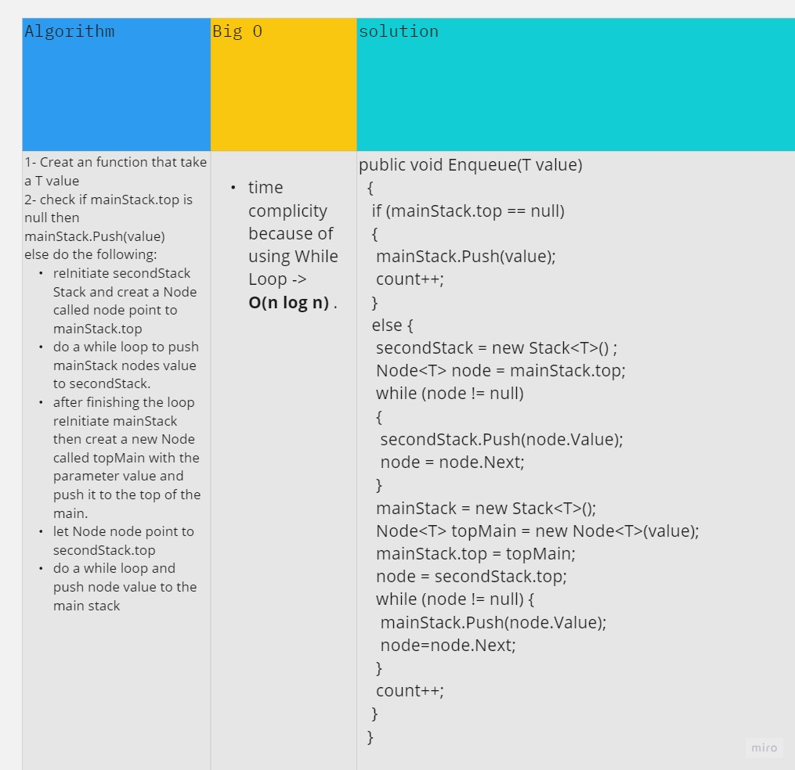
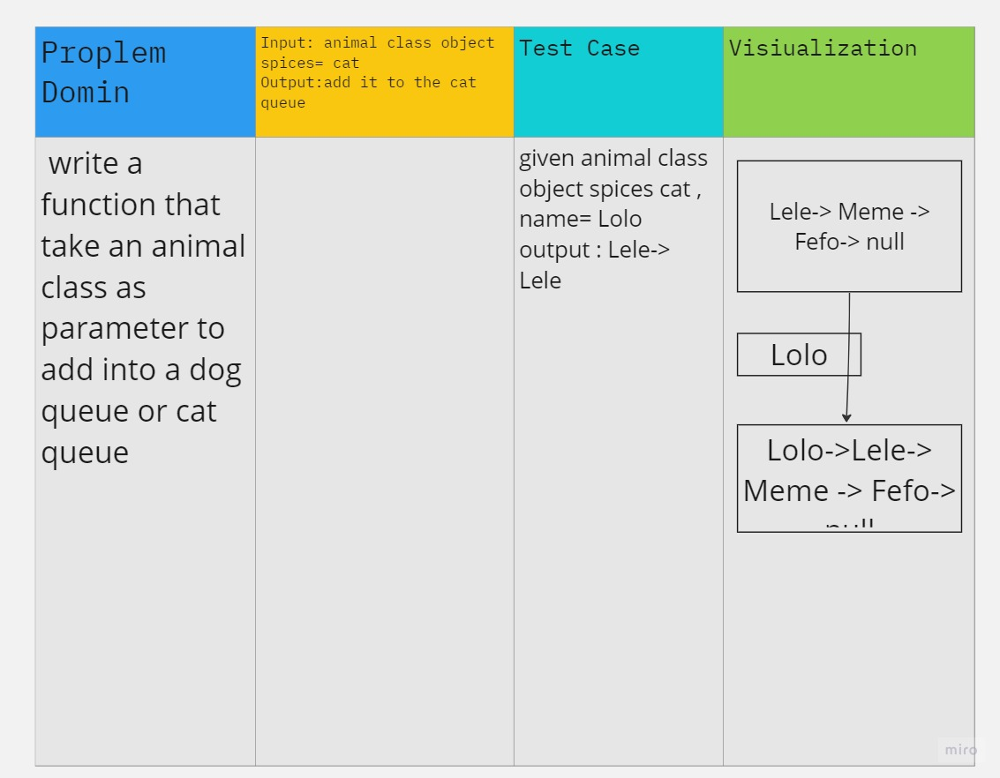
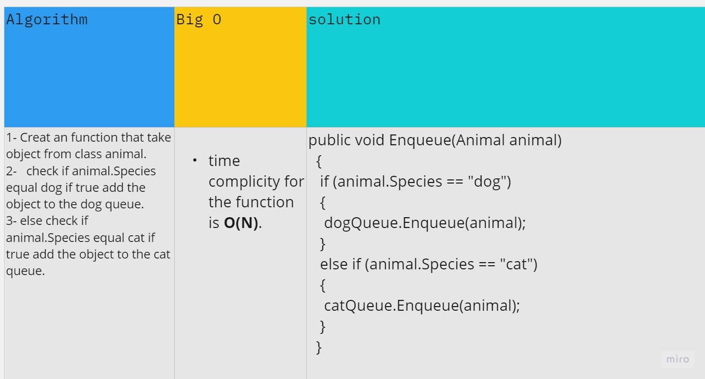
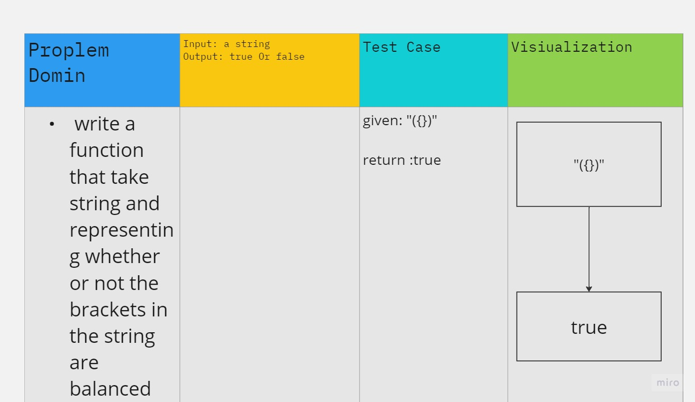
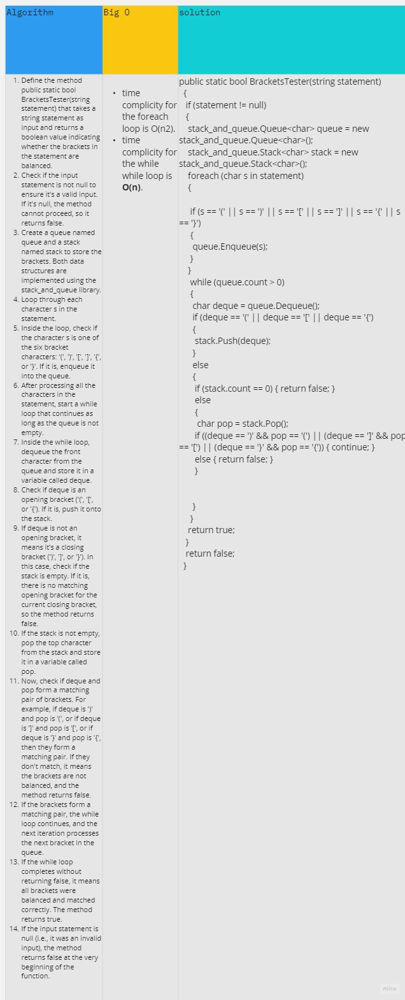

# Stack And Queue

this console app is an implementstion for Stack and Queue Concept
I created my oun Stack and Queue Generic Classes
with a Generic Node class, then creat a xUnit project to test each function
 the console screen will show an Integer Stack and Queue with some process as the picture shows

 

## whiteboard for push method in stack

# CC 11 PseduoQueue

I finished the PseudoQueue Class with a Unit test successfully.

# CC 12 AnimalShelter
I finished the AnimalShelter Class with a Unit test successfully.

# CC 13 validate brackets
I finished the validateBrackets Method in the Program class with a three successful unit test methods.

